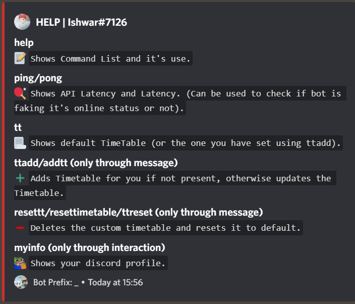
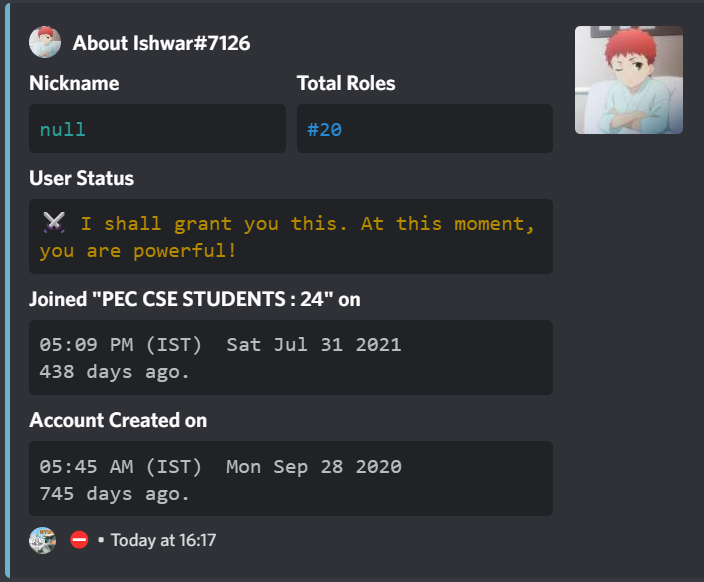
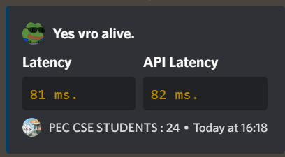
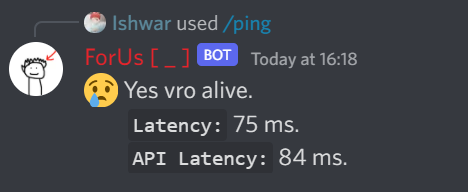

# ForUs

| Command Name | Desciption | Command Type |
|--------------|------------|--------------|
| [HELP](#help-command) | Shows Command List and it's use. | Only Message |
| [PING / PONG](#ping-command) | Shows API Latency and Latency. (Can be used to check if bot is faking it's online status or not). | Both |
| TT | Shows default TimeTable (or the one you have set using ttadd). | Both | 
|  TTADD/ ADDTT | Adds Timetable for you if not present, otherwise updates the Timetable. | Only Message |
| RESETTT/ RESETTIMETABLE/ TTRESET | Deletes the custom timetable and resets it to default. | Only Message |
| [MYINFO](#myinfo-command) | Shows your discord profile. | Only interaction |

### HELP COMMAND
---

### MY INFO COMMAND
---

### PING COMMAND
---

**USING MESSAGE TO INTERACT(May get removed without any warning)**

**USING SLASH COMMANDS**

